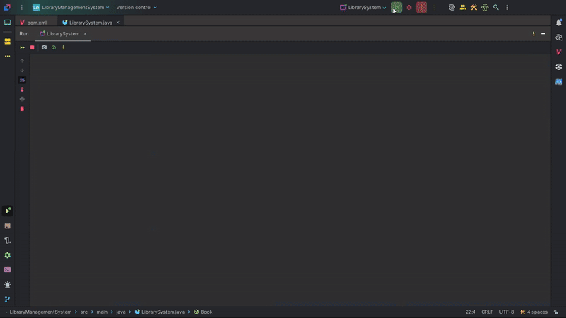

# Library-Management-System.
The system was build as a Library Management System that will store, search, and manage books. The system demonstrates an understanding of Lists, Collections, Stacks, Queues, Sorting/Searching algorithms, and OOP concepts including Inheritance and Polymorphism.

## 🔑 Console Menu & Sub-Menus

## ✨ Key Features.
- 📚 **Library Organization:** Store a collection of Book objects using an Arr<List> implementation. 
- 📤 **Classes, Inheritance & Polymorphism:** Has a base class Book and with two subclasses (e.g., eBook and Printed Book) that can be overridden by some methods.
- 📜 **Books:** Each Book has its own attributes (e.g., ID, Title, Author, yearPublished, and Category).<\br>
- 🌐 **Navigation:** Implement a simple console-based menu with input validation and exception handling, to navigate through the library system.
- 💼 **Manage library's books:**
  - ➕ Add books to the library records.
  - ➖ Remove books from the library records.
  - ✏️ Edit a book's details on the library records.
- ✨ **Sorting:**
  - 💻 Sorting Algorithms: Implements two different sorting algorithms (e.g., Quick Sort and Merge Sort) to arrange the books by title.
  - 🆚 Performance Comparison: Can display the time taken for each sorting algorithm to be completed for performance comparison.
- 🧠 **Searching:** Implements a searching feature for books by title using binary search after the books have been sorting.
- 🔄 **Undo/Redo:** A feature where book additions can be undone/redone using to stacks (e.g., undoStack and redoStack).
- 🌍 **Catalog:**
  - 📖 **Displays All Books:** Shows the library's entire catalog alphabetically (books by title).
  - 🗂️ **Categories:** Groups library books by category.
- 💲**Late Fees:** Calculates a books late fees.
- 🎲 **Recommend Book:** Recommends a random book from the library.

## 🚀 How to Run Library-Management-System.
Link to the sample section: [Link Text](#sample-section).
1. Install these:
  - [Java Development Kit (JDK)](https://www.oracle.com/africa/java/technologies/downloads/).
  - Integrated development environment Software / java (Choose one)
    - [Intellij Idea Ultimate/Community](https://lp.jetbrains.com/intellij-idea-promo/?source=google&medium=cpc&campaign=EMEA_en_AFRICA_IDEA_Branded&term=intellij%20idea&content=693349187736&gad_source=1&gad_campaignid=9736964638&gbraid=0AAAAADloJzhiU-Ux6ZhORL6v-jCaVJ6Th&gclid=EAIaIQobChMIjLiMooHxjwMVxIBQBh3DLAeuEAAYASAAEgL9lfD_BwE)
    - [Netbeans](https://netbeans.apache.org/front/main/index.html)
    - [Ellipse IDE](https://eclipseide.org/)
2. Download the "Library-Management-System" folder.
3. Open your IDE of choice.
4. Open the downladed project folder and browse to the downloaded folder named "Library-Management-System" and select it. This should load the Java project.
5. Everything is setup for the Java project to be executed.
6. Now you are ready to run the project!

## 👨‍💻 Authors

If you liked this repo then kindly support it by giving it a star ⭐ and share it with your friends so that more people can benefit from the effort.

## ⚠️ Issues
The Java program contains code and comments that are not fully optimized. The code may include redundant sections, unoptimized logic, and inefficient algorithms. The comments are also inconsistent, with some sections having no comments, others containing poorly written explanations, and some comments not accurately reflecting the code's function. 
> Despite these issues, the program is designed to be functional, and it's expected to run without critical errors. This is a temporary state, and future updates will include a thorough code cleanup and optimization process. 🧹

## ⚖️ License

Copyright (c) 2025-present, Taay21Sosa, T.Monaheng.

## 🤝 Follow My Journey

  
  
   
  

